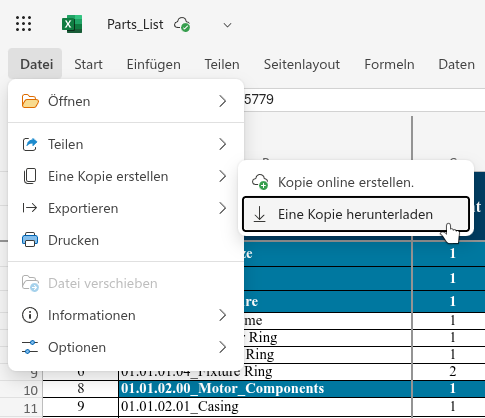
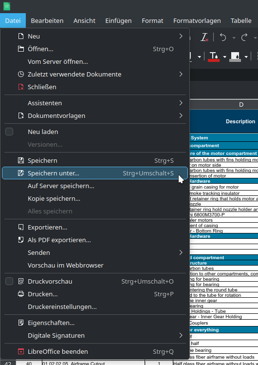
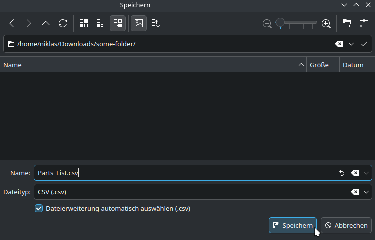
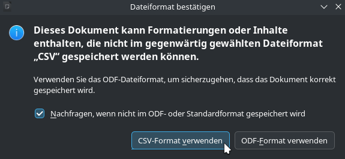
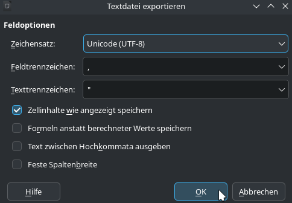
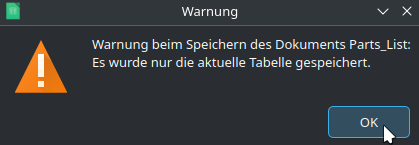
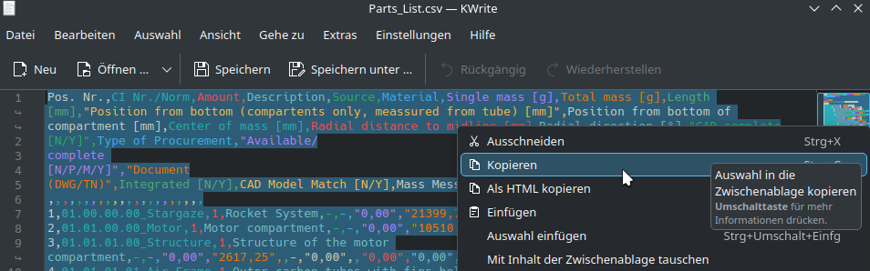
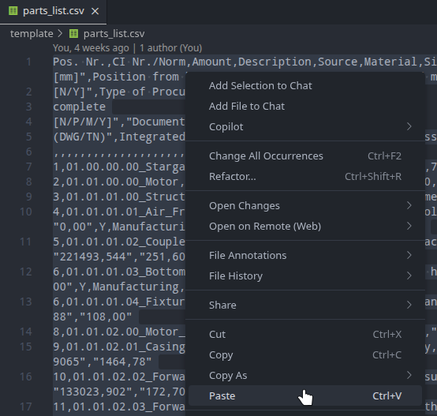

# bears-flight-simulation

[](https://github.com/bears-space/bears-flight-simulation/actions/workflows/pre-commit.yaml)
[](https://github.com/bears-space/bears-flight-simulation/actions/workflows/pytest.yaml)
[](https://github.com/bears-space/bears-flight-simulation/actions/workflows/ruff.yaml)
[](https://github.com/bears-space/bears-flight-simulation/actions/workflows/windows-exe.yaml)

This is the [RocketPy](https://github.com/RocketPy-Team/RocketPy/)-based flight simulation for BEARS rockets, built by [BEARS (Berlin Experimental Astronautics Research Student Team e.V.)](https://www.bears-space.de/).

## Usage

### Setup / Installation

#### Setup uv

First, we need to install `uv`, a Python package manager.

- On Linux and macOS, use `curl -LsSf https://astral.sh/uv/install.sh | sh`.
- On Windows, use `powershell -ExecutionPolicy ByPass -c "irm https://astral.sh/uv/install.ps1 | iex"`.
- When in doubt, refer to the official setup instructions: <https://docs.astral.sh/uv/getting-started/installation/>

#### Sync dependencies with uv

To install or update the dependencies of this project, run this command from within the project root:

```sh
uv sync
```

The `uv` package manager also automatically manages a separate Python installation for the project, so you do not have to think about your system-wide Python installation and pip packages.

#### Setup pre-commit

To ensure a consistent style in the repository, pre-commit hooks are used.

Within the project root, install the pre-commit hooks to the local repository:

```sh
pre-commit install
```

The hooks are based on the configuration located in `.pre-commit-config.yaml` and will be run automatically before every git commit.

### Basic usage

If you just want to run the simulation with default parameters, you can use one of the two provided scripts (assuming you installed Python and all required packages).

**On Windows**, run the following in a command prompt:

```ps
powershell -ExecutionPolicy Bypass -file .\run-simulation.ps1
```

**On Linux**, run the following in a terminal:

```sh
bash ./run-simulation.sh
```

In both cases, the simulation uses the `./template` folder to read its configuration and the `./output` folder for output.

### Advanced usage

The package contains two commands: The simulation (`sim`) and the GUI (`gui`).

You can run the simulation from a terminal as follows:

```sh
uv run python -m bears_flight_simulation sim ./input --output ./output
```

To see the available command line parameters, run one of the following (depending on what info you need):

```sh
uv run python -m bears_flight_simulation --help
uv run python -m bears_flight_simulation sim --help
uv run python -m bears_flight_simulation gui --help
```

### Run unit tests

To run the provided unit tests, run this command from within the project root:

```sh
uv run python -m pytest
```

### Windows GUI executable (.exe)

This repository contains an automated GitHub Actions workflow that builds a standalone Windows `.exe` for the GUI.

- Workflow: `.github/workflows/windows-exe.yaml`
- Output artifact: `bears-flight-simulation-windows-exe`
- Executable filename: `bears-flight-simulation.exe`

The build uses PyInstaller in one-file mode and bundles Python plus all required dependencies into a single portable executable.

### Configuration

A file for the motor has to be provided in `.eng` format. On at least one website offering compatible files, this format has been referred to as "RASP" format. It is documented here: <https://www.thrustcurve.org/info/raspformat.html>

## How to import up-to-date parts list

The parts list is provided by BEARS in Excel (.xlsx) format. The following steps are used to convert it into a format usable by the flight simulation.

First, open the parts list Excel table online and store a local copy (*Datei -> Eine Kopie Erstellen -> Eine Kopie herunterladen*):



Second, open the local copy (.xlsx) in LibreOffice Calc and save it as a CSV file (.csv), accepting the warning dialogs about exporting to CSV:







Finally, open the CSV file (.csv) in a text editor, copy the contents and paste them into `template/parts_list.csv`, replacing the old file contents.



